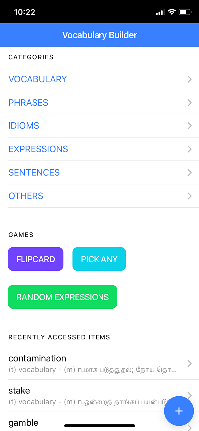
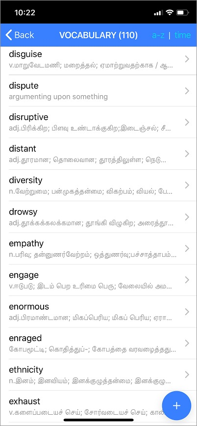
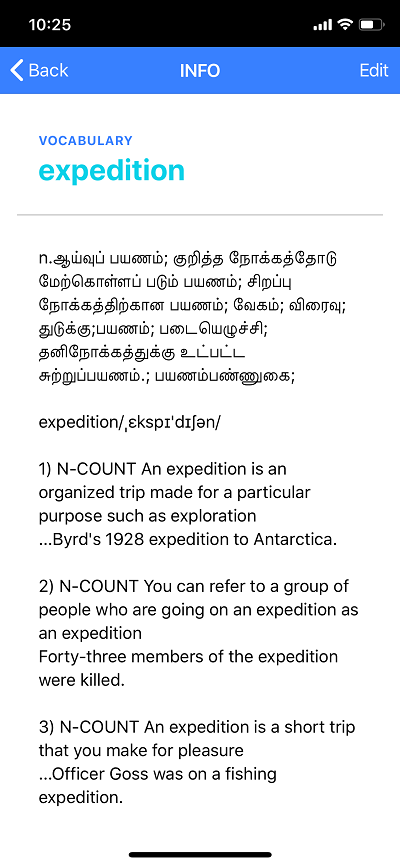
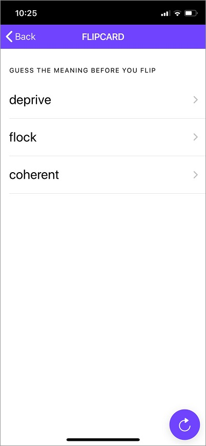
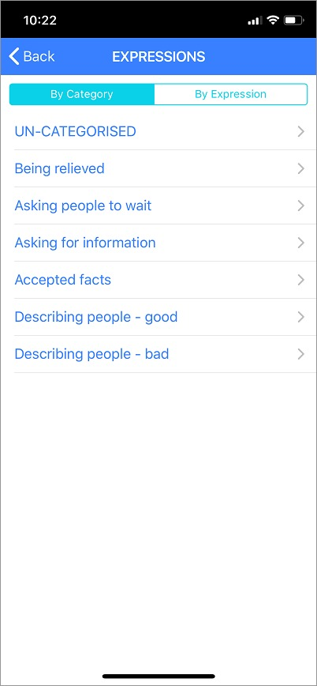
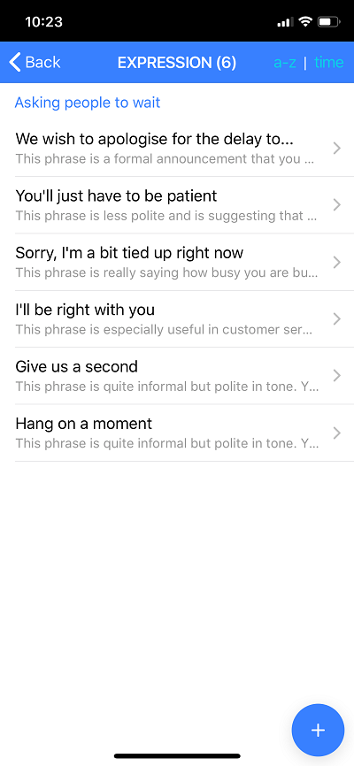

# Vocabulary Builder

Its a Progressive Web App built in Ionic framework to facilitate building our own vocabulary base. It also provide few methods to get practive with what we learn. 

## App Home Screen

## Vocabulary Listing Screen 

## Vocabulary Info Screen

## FLIPCARD Game Screen

## Expressions Home Screen

## Expressions Listing Screen

## Sentences Listing Screen 

